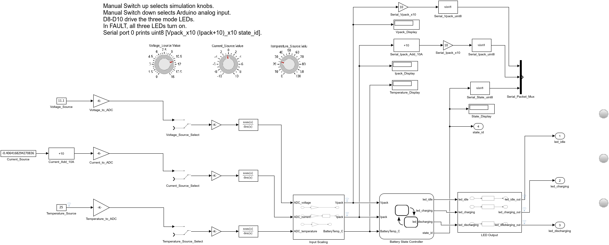
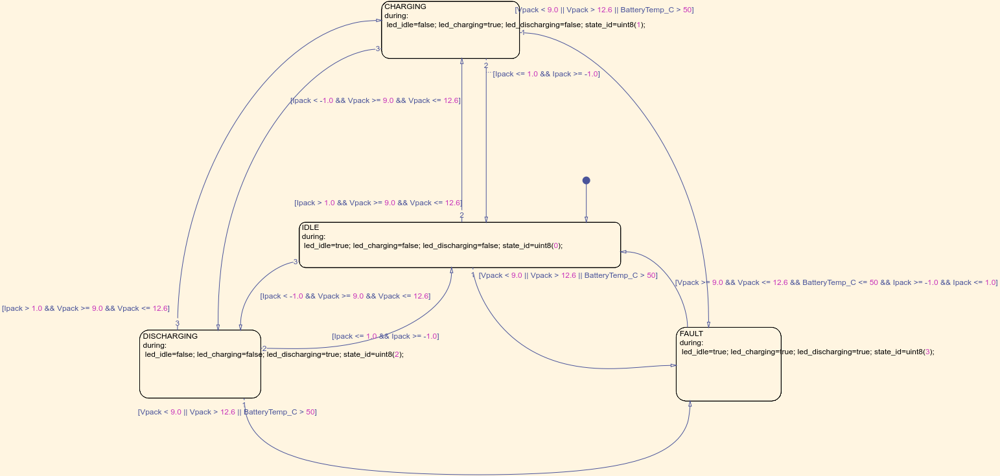
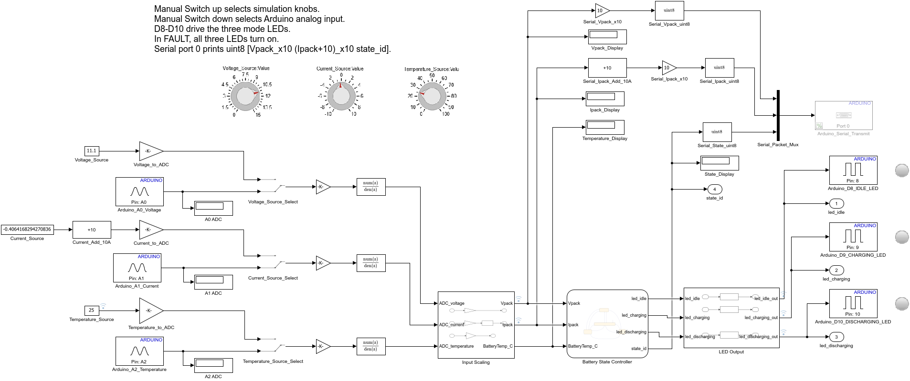
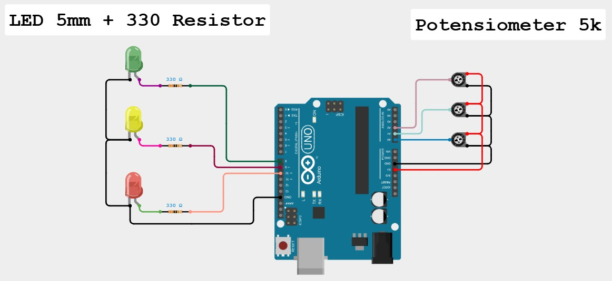

<div align="center">

</div>

# Hands-On Workshop — Stateflow, Code Generation & Deployment to Arduino Uno

## Battery State Controller Model (EN)

| Metadata | |
|----------|---|
| **Duration** | 120 minutes (40 min instruction + 50 min hands-on + 30 min deploy & challenge) |
| **MATLAB Products** | MATLAB, Simulink, Stateflow, Embedded Coder, Simulink Support Package for Arduino Hardware |
| **Target Hardware** | Arduino Uno (ATmega328P) — 1 board per group of 3 |
| **Prerequisite Knowledge** | Basic MATLAB (variables, scripts) and basic Simulink (blocks, simulation) |

---

## 1. Workshop Overview

In this 2-hour hands-on workshop you will build a **Battery State Controller** — a finite-state machine that monitors a battery pack's voltage, current, and temperature and decides its operating mode:

| State | Meaning | LED (state_id) |
|-------|---------|----------------|
| **IDLE** | Safe voltage, near-zero current | D8 ON (0) |
| **CHARGING** | Safe voltage, positive current | D9 ON (1) |
| **DISCHARGING** | Safe voltage, negative current | D10 ON (2) |
| **FAULT** | Undervoltage / overvoltage / overtemperature | D8, D9, D10 ON (3) |

You start from a **starter model** (`starter_model.slx`) that already contains the simulation scaffolding, then you:

1. ✅ **Verify toolboxes** — confirm Stateflow, Embedded Coder, and the Arduino support package are installed.
2. ✅ **Build the Stateflow chart** — add 4 states, transitions, and `during` actions from the requirements.
3. ✅ **Simulate & validate** — run the 7 test cases from `tests/battery_mode_test_cases.csv`.
4. ✅ **Generate code** — produce C code with Embedded Coder.
5. ✅ **Deploy to Arduino Uno** — flash the board and read the serial status packet.
6. ✅ **Challenge** — change the undervoltage threshold 9.0 V → 9.6 V and re-deploy.

> 💡 The **completed model** (`models/completed_model.slx`) is your answer key. Use it if you fall behind — but try to build it yourself first.

---

## 2. Learning Objectives

After this session you will be able to:

1. ✅ Verify the required MathWorks toolboxes and hardware support package.
2. ✅ Open and navigate a Stateflow chart inside Simulink.
3. ✅ Model a finite-state machine with **states, transitions, and guards** (`[condition]`).
4. ✅ Use `during` actions to drive outputs every time step.
5. ✅ Connect Stateflow to Simulink inputs/outputs (data scope: Input/Output).
6. ✅ Simulate a model and validate behaviour against requirements.
7. ✅ Generate embedded C code and understand the generated files.
8. ✅ Deploy a Simulink model to **Arduino Uno** and read serial output.

---

## 3. Toolbox Verification (Step 1, ~10 min)

Open MATLAB and run the **project file** first so the path and settings are configured:

```matlab
>> openProject('StateflowCodeGenerationWorkshop.prj')
```

Then verify every required product is installed:

```matlab
>> ver('stateflow')      % Stateflow
>> ver('simulink')       % Simulink
>> ver('ecoder')         % Embedded Coder
```

> 🪟 **Run this in the MATLAB Command Window (single window).** A version table means the product is installed. If a product is **missing**, install it from **Home → Add-Ons → Get Add-Ons** (search the product name).

**Also confirm the Arduino support package** (this is a *Support Package*, not a Toolbox, so `ver` will NOT list it):

```matlab
>> supportPackageInstaller
```

In the installer window, confirm **"Simulink Support Package for Arduino Hardware"** shows **Installed**. If not, select it and click **Install**.

**Minimum expected products (from `ver`):**

| Product | `ver` argument | Purpose |
|---------|---------------|---------|
| Stateflow | `ver('stateflow')` | State machine modelling |
| Simulink | `ver('simulink')` | Model host |
| Embedded Coder | `ver('ecoder')` | Optimised, hardware-ready C |

> 🔧 **Installing a missing product (toolbox):** open **Home → Add-Ons → Get Add-Ons** (Add-On Explorer), search the product name, and click **Install** (internet + MathWorks account required). The **Dependency Analyzer** (App → or `analyze` on your model or its dependencies) confirmed the required products for this workshop: **MATLAB, Simulink, Stateflow, Embedded Coder** — plus **Simulink Support Package for Arduino Hardware** for deployment.

---

## 4. Open the Starter Model (Step 2, ~5 min)

```matlab
>> open_system('models/starter_model.slx')
```

The starter model already contains (read-only for this step):

- **Dashboard Knobs** — `Voltage_Knob_V`, `Current_Knob_A`, `Temperature_Knob_C` (simulation inputs).
- **Source Select** — `Voltage_Source_Select`, `Current_Source_Select`, `Temperature_Source_Select` (switch between simulation knobs and real Arduino pins).
- **Input Scaling** — converts knobs/ADC to `Vpack`, `Ipack`, `BatteryTemp_C`.
- **Battery State Controller** — the Stateflow chart. In the starter it is **empty** (no states yet).
- **LED Output** — drives `led_idle`, `led_charging`, `led_discharging`, `state_id`.
- **Serial blocks** — `Serial_Packet_Mux` + `Arduino_Serial_Transmit` (active only on hardware).


*Figure 1: Top-level model as it opens in the starter — note the **Battery State Controller** chart block is still empty. Simulation inputs (Dashboard Knobs) feed Input Scaling, the chart will decide the state, and LEDs + Serial report it.*

> 🎤 **Narration (presenter):** "The starter model is like a car without an engine. All the wiring — the dashboard, the scaling, the LED panel — is already connected. Your job in the next steps is to install the *brain*: the Stateflow chart that reads Vpack, Ipack, and BatteryTemp_C and decides which state we are in."

---

## 5. Build the Stateflow Chart (Steps 3–7, ~40 min)

Double-click the **Battery State Controller** chart to open the Stateflow Editor.

### Step 3: Add the four states

Drag **four State** shapes from the Stateflow palette (or right-click → **Add State**) onto the canvas. Double-click each and name it:

| State name | Position (suggested) |
|------------|----------------------|
| `IDLE` | left, upper |
| `CHARGING` | center, upper |
| `DISCHARGING` | left, lower |
| `FAULT` | center, lower |

### Step 4: Add `during` actions to each state

Click inside each state and type its `during` action (runs every simulation step while in that state):

```matlab
% IDLE
during:
 led_idle = true;  led_charging = false; led_discharging = false; state_id = uint8(0);
```

```matlab
% CHARGING
during:
 led_idle = false; led_charging = true;  led_discharging = false; state_id = uint8(1);
```

```matlab
% DISCHARGING
during:
 led_idle = false; led_charging = false; led_discharging = true;  state_id = uint8(2);
```

```matlab
% FAULT
during:
 led_idle = true;  led_charging = true;  led_discharging = true;  state_id = uint8(3);
```

> 💡 **Why `during`?** The chart re-evaluates every step. A `during` action keeps the LEDs and `state_id` held correctly for the whole time the state is active — exactly what the requirements (REQ-06, REQ-07) ask for.

### Step 5: Add the transitions (guards)

Draw a **transition** from one state to another, then double-click the arrow and type the guard condition inside `[ ]`. Build all transitions from `requirements/battery_mode_requirements.csv`:

| From → To | Guard condition | Requirement |
|-----------|-----------------|-------------|
| IDLE → CHARGING | `[Ipack > 1.0 && Vpack >= 9.0 && Vpack <= 12.6]` | REQ-04 |
| IDLE → DISCHARGING | `[Ipack < -1.0 && Vpack >= 9.0 && Vpack <= 12.6]` | REQ-05 |
| IDLE → FAULT | `[Vpack < 9.0 || Vpack > 12.6 || BatteryTemp_C > 50]` | REQ-01/02/08 |
| CHARGING → IDLE | `[Ipack <= 1.0 && Ipack >= -1.0]` | REQ-03 |
| CHARGING → DISCHARGING | `[Ipack < -1.0 && Vpack >= 9.0 && Vpack <= 12.6]` | REQ-05 |
| CHARGING → FAULT | `[Vpack < 9.0 || Vpack > 12.6 || BatteryTemp_C > 50]` | REQ-01/02/08 |
| DISCHARGING → IDLE | `[Ipack <= 1.0 && Ipack >= -1.0]` | REQ-03 |
| DISCHARGING → CHARGING | `[Ipack > 1.0 && Vpack >= 9.0 && Vpack <= 12.6]` | REQ-04 |
| DISCHARGING → FAULT | `[Vpack < 9.0 || Vpack > 12.6 || BatteryTemp_C > 50]` | REQ-01/02/08 |
| FAULT → IDLE | `[Vpack >= 9.0 && Vpack <= 12.6 && BatteryTemp_C <= 50 && Ipack >= -1.0 && Ipack <= 1.0]` | recovery |


*Figure 2: The completed 4-state chart with all transitions, as it appears in the Stateflow Editor. Use this as your reference while drawing.*

### Step 6: Confirm the chart data (inputs / outputs)

In the Stateflow Editor, open the **Symbols** pane (or **Model Explorer**). The chart must expose:

| Symbol | Scope | Type |
|--------|-------|------|
| `Vpack` | Input | double |
| `Ipack` | Input | double |
| `BatteryTemp_C` | Input | double |
| `led_idle` | Output | boolean |
| `led_charging` | Output | boolean |
| `led_discharging` | Output | boolean |
| `state_id` | Output | uint8 |

> ✅ If you named the states and actions exactly as above, Stateflow auto-resolves these symbols. If a symbol shows a red **?**, right-click it → **Resolve to Input/Output Data**.

### Step 7: Update & save

```matlab
>> set_param('starter_model','SimulationCommand','update')
>> save_system('starter_model')
```

---

## 6. Simulate & Validate (Step 8, ~15 min)

For desktop simulation, keep the **Source Select** switches **up** (toward the Dashboard knobs).

### Step 8a: Run the 7 test cases

Open `tests/battery_mode_test_cases.csv`. For each row, set the three knobs to the `Vpack`, `Ipack`, `Temperature_C` values, then **Run** (Ctrl+T) and read `state_id` / the State Display.

| # | Test Case | Vpack | Ipack | Temp (°C) | Expected State | state_id |
|---|-----------|-------|-------|-----------|----------------|----------|
| 1 | Normal idle | 11.1 | 0 | 25 | IDLE | 0 |
| 2 | Charging | 11.1 | 5 | 25 | CHARGING | 1 |
| 3 | Discharging | 11.1 | -5 | 25 | DISCHARGING | 2 |
| 4 | Undervoltage fault | 8.5 | 0 | 25 | FAULT | 3 |
| 5 | Overvoltage fault | 13.0 | 0 | 25 | FAULT | 3 |
| 6 | Overtemperature fault | 11.1 | 0 | 60 | FAULT | 3 |
| 7 | Fault recovery | 11.1 | 0 | 25 | IDLE | 0 |

> ✅ **Pass criterion:** the State Display block shows the Expected State and `state_id` matches for all 7 cases. If a case fails, re-check the guard conditions (Step 5) — a typo in `&&` / `||` is the usual cause.

> 🪟 **Tip:** drag the knobs, then click **Run**. Watch `Vpack_Display`, `Ipack_Display`, `State_Display`. The expected value appears after one sample step (SampleTime 0.1 s).

---

## 7. Generate Code (Step 9, ~10 min)

With the logic validated, generate embedded C code:

```matlab
>> slbuild('starter_model')
```

This runs **Embedded Coder** using the model's configuration:
- System target file: `ert.tlc`
- Hardware board: **Arduino Uno**
- Toolchain: **Arduino AVR**

**Inspect the generated code** (created in `starter_model_ert_rtw/`):

| File | What it contains |
|------|------------------|
| `starter_model.c` / `.h` | Model entry points (`model_initialize`, `model_step`, `model_terminate`) |
| `starter_model_data.c` | Parameters and signal data |
| `ert_main.c` | Example main loop (not used on Arduino — the support package provides its own) |
| `starter_model_generate_report.html` | Code generation report |

> 💡 **Key takeaway:** the same Stateflow chart you drew produced a `model_step()` function that switches states in plain C — no manual coding. Open `starter_model.c` and search for `IDLE` / `CHARGING` to see how Stateflow compiles states into a `switch` on the state variable.

> ⚠️ An **Embedded Coder license** is required for `slbuild`. If you only have the Arduino Support Package, the *deploy* step (Step 10) still works because it triggers code generation internally — but the standalone `slbuild` report is the clearest way to *see* the code.

---

## 8. Deploy to Arduino Uno (Step 10, ~15 min)

### Step 10a: Switch to hardware inputs

In the model, set the three **Source Select** switches **down** (toward the Arduino pins):

- `Voltage_Source_Select` → Arduino **A0** (battery voltage divider)
- `Current_Source_Select` → Arduino **A1** (current sensor)
- `Temperature_Source_Select` → Arduino **A2** (temperature)

The LED Output block already maps to digital pins:

| State | Pin | LED |
|-------|-----|-----|
| IDLE | D8 | led_idle |
| CHARGING | D9 | led_charging |
| DISCHARGING | D10 | led_discharging |
| FAULT | D8, D9, D10 | led_idle + led_charging + led_discharging (all ON) |


*Figure 3: The completed top-level model ready for deployment — the Source Select switches feed the Arduino pins (A0/A1/A2), with the LED Output and Serial blocks wired.*


*Figure 4: The fully assembled hardware — potentiometers on A0/A1/A2 and the three status LEDs (330 Ω) on D8/D9/D10.*

> 🛠️ **Wiring (per group):** connect a **1 kΩ–20 kΩ** potentiometer to A0 (simulates Vpack), A1 (Ipack), A2 (temperature). Connect **3 LEDs** with 330 Ω resistors to **D8, D9, D10** (GND). For a quick check, sweep A0 with the pot: low voltage → FAULT (D8, D9, D10 all ON), safe mid → IDLE (D8 only), raise A1 above mid → CHARGING (D9 only), lower A1 below mid → DISCHARGING (D10 only).

### Step 10b: Configure & build for hardware

1. **Apps → Hardware Setup** or set in **Model Settings (Ctrl+E)**:
   - **Hardware Implementation → Hardware board:** `Arduino Uno`
   - **Solver:** `Fixed-step`, `discrete (no continuous states)`, Fixed-step size `0.1`
2. **Hardware → Build, Deploy & Start** (or `Ctrl+B`).

MATLAB compiles, uploads the `.hex` to the Uno over USB, and starts it.

### Step 10c: Read the serial status packet

Open the **Arduino Serial Monitor** (or MATLAB `serialport`) at the default baud. The model transmits one byte packet per step:

```
[ Vpack_x10 , (Ipack+10)_x10 , state_id ]
```

Example: `111 100 0` → Vpack = 11.1 V, Ipack = 0.0 A, state = **IDLE**.

```matlab
% Optional: read from MATLAB instead of the Serial Monitor
>> s = serialport("COM3", 9600);   % replace COM3 with your port
>> read(s, 3, "uint8")
```

> 💡 Only one host may open the serial port at a time — close the Arduino Serial Monitor before using `serialport` in MATLAB, and vice versa.

---

## 9. Challenge (Step 11, ~10 min)

Change the **undervoltage threshold** from `9.0` to `9.6` V in every guard that references it:

- IDLE → FAULT, CHARGING → FAULT, DISCHARGING → FAULT: `[Vpack < 9.6 || Vpack > 12.6 || BatteryTemp_C > 50]`
- IDLE → CHARGING / DISCHARGING, and the recovery/charging guards: use `Vpack >= 9.6` in the safe band.

Re-run test case 4 with `Vpack = 9.3`: previously **IDLE** (9.3 ≥ 9.0 = safe), now **FAULT** — the new guard `[Vpack < 9.6 …]` triggers, so the fault LEDs light at a higher voltage than before. Re-deploy to Arduino if time allows.

> 🔴 **Advanced extension:** add a 5th state `BALANCING` and a hysteresis band so the controller does not chatter between CHARGING and DISCHARGING when Ipack sits near 0 A.

---

## 10. Summary

| Phase | Command / Action | Key Takeaway |
|-------|------------------|--------------|
| Verify | `ver('stateflow')`, `supportPackageInstaller` | Know what is installed before building |
| Model | Stateflow chart: states + `[guards]` + `during` | A state machine is just states + guarded transitions |
| Simulate | Dashboard knobs + 7 test cases | Validate logic *before* touching hardware |
| Generate | `slbuild('starter_model')` | Stateflow → readable embedded C |
| Deploy | Hardware board = Arduino Uno, `Ctrl+B` | Same model runs on real silicon |
| Observe | Serial packet `[V I state]` | Closed loop: model ↔ hardware |

### Architecture Learned

```
Requirements (CSV)  ->  Stateflow chart  ->  Simulink model  ->  Generated C  ->  Arduino Uno
        REQ-01..08        4 states              LEDs+Serial         ert.tlc          D8, D9, D10 + Serial
```

---

## 11. Troubleshooting

| Issue | Possible Cause | Solution |
|-------|----------------|----------|
| Arduino support package missing | Not installed | `supportPackageInstaller` → install "Simulink Support Package for Arduino Hardware" |
| Symbol shows red `?` in chart | Scope not resolved | Right-click symbol → Resolve to Input/Output Data |
| Wrong state in simulation | Typo in `&&` / `||` guard | Compare guards to the Step 5 table line by line |
| `slbuild` license error | No coder license | Use Deploy (`Ctrl+B`) which generates internally; or obtain Embedded Coder |
| Upload fails / "port busy" | Serial Monitor open or wrong COM | Close Serial Monitor; pick correct COM port in Device Manager |
| LED never lights on Uno | Source Select still "up" | Flip the 3 Source Select switches **down** to Arduino pins |
| state_id wrong on hardware | Knob still driving input | Confirm Source Select = down (Arduino A0/A1/A2) |

---

## 12. MathWorks References

- [Getting Started with Stateflow](https://www.mathworks.com/help/stateflow/getting-started-with-stateflow.html)
- [Model Finite State Machines](https://www.mathworks.com/help/stateflow/ug/why-use-stateflow-charts.html)
- [Generate Code for Arduino Hardware (Simulink)](https://www.mathworks.com/help/supportpkg/arduino/ug/install-support-for-arduino-hardware.html)
- [Simulink Support Package for Arduino Hardware](https://www.mathworks.com/hardware-support/arduino-simulink.html)
- [Getting Started with Embedded Coder](https://www.mathworks.com/help/ecoder/getting-started-with-embedded-coder.html)

---

*Hands-On Workshop material · TechSource Systems*
